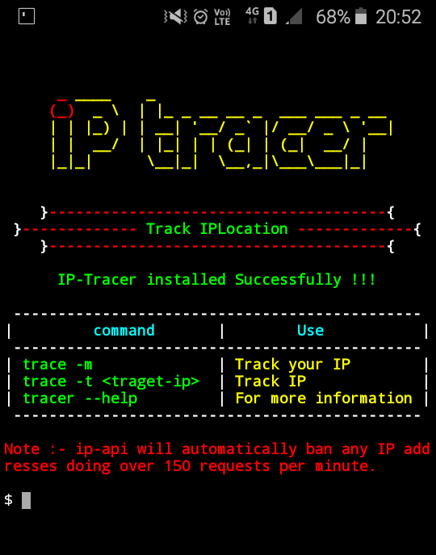

## What is IP-Tracer ?
 
IP-Tracer is used to track an ip address. IP-Tracer is developed for Termux and Linux based systems. you can easily retrieve ip address information using IP-Tracer. IP-Tracer use ip-api to track ip address.
 

 
## How to install IP-Tracer ?
 
* `apt update`
 
* `apt install git -y`
 
* `git clone https://github.com/CLB-09/IP-Tracer.git`
 
* `cd IP-Tracer`
 
* `chmod +x install`
 
* `sh install` or `./install`
 
 
## How to use IP-Tracer
 
* `trace -m` to track your own ip address.
 
* `trace -t target-ip` to track other's ip address for example `ip-tracer -t 127.0.0.1`
 
* `trace` for more information.
 
**OR**
 
* `ip-tracer -m` to track your own ip address.
 
* `ip-tracer -t target-ip` to track other's ip address for example `ip-tracer -t 127.0.0.1`
 
* `ip-tracer` for more information.

## Find Me on :

 
 
